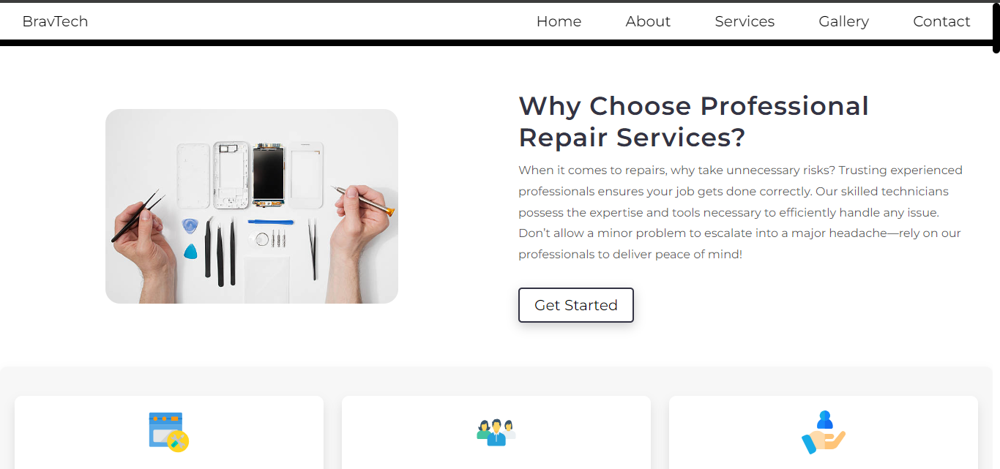

# 🔧 BravTech

> A modern and responsive website built for a skilled technician who offers professional repair services for phones, laptops, and a wide range of electronic devices.


---

## 📸 Project Preview

 <!-- Optional: Update with actual screenshot URL if available -->

---

## 🚀 Features

- 💻 Professional landing page
- 📱 Fully responsive design for all devices
- 🧰 Services section for phone, laptop, and electronics repair
- 📇 Contact section with working form design
- 🎨 Clean layout using SCSS for structured styling

---

## 🛠️ Tech Stack

- **Frontend**: HTML5, CSS3, JavaScript
- **Styling**: SCSS (Sass)
- **Tools**: Visual Studio Code, Live Server

---

## 📂 Installation

To run this project locally:

1. Clone the repository

```bash
    git clone https://github.com/ShuaibShaban/BravTech.git

2. Navigate to this project directory

    cd BravTech

3. Open index.html in Visual Studio Code

4. Right-click and choose "Open with Live Server"
  (Make sure the Live Server extension is installed)

💡 Usage

Explore the landing page to view service categories, get contact info, and see the responsive layout across devices.

📍 Live Demo

[Live Demo](https://bravtech.vercel.app)

🙏 Acknowledgments
Designed and developed for a technician client to showcase and promote repair services.

Icons and fonts from FontAwesome and Google Fonts

📄 License
This project is licensed under the MIT License.

👨‍💻 Author
Made with 💙 by Shuaib Shaban

